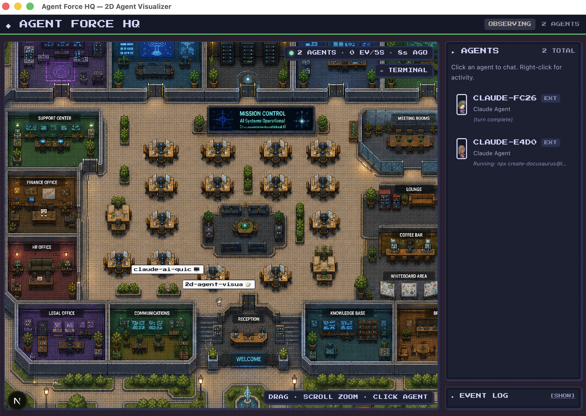

# Agent Force HQ

A 2D pixel-art desktop app where every Claude agent on your laptop
becomes a visible character in a top-down office. Watch your agents
walk between rooms as they think, code, search, and run tools — in
real time, driven by actual hook events from each running `claude`
session.



Built with Next.js, Phaser, Zustand, and Electron. Packaged as a
native macOS app.

## Why

When you have multiple Claude sessions running across terminals,
IDEs, and project directories, it's hard to keep a mental model of
who's doing what. Agent Force HQ turns that invisible activity into a
**living office floor** — a cozy, glanceable visualization where:

- Each running `claude` session is an NPC with a stable look and name.
- The room they're in tells you what they're doing right now.
- The pill above their head shows the current tool with an emoji.
- Idle agents drift to a desk and sit until the next event arrives.

It's the difference between watching a status bar and watching your
agents *actually work*.

## Quick start

```bash
npm install
npm run dev
```

That launches the Next.js dev server and opens the Electron window.

The first time it runs, you'll see a **◆ LIVE HOOKS NOT INSTALLED**
banner at the top. Click **Install hooks** to wire Agent Force HQ
into your `~/.claude/settings.json` (one-click; reversible). After
that, run `claude` in any project and the agent should walk into
Reception within a few seconds.

If you'd rather install manually or want to know exactly what gets
written to disk, see [`docs/install.md`](docs/install.md).

For a packaged macOS build:

```bash
npm run pack    # unsigned .app in release/mac-arm64/
npm run dist    # signed .dmg, requires Apple notarization env vars
```

## How it works at a glance

```
Claude CLI hook event
  → ~/.agentquest/bin/post-hook.sh    (POST 127.0.0.1:47329)
  → electron/hook-server.js           (validate + relay)
  → IPC "claude:hook"
  → src/agents/hook-provider.ts       (tool → state → room, parent linker)
  → useAgentStore + useNpcStore       (Zustand stores)
  → src/game/WorldScene.ts            (BFS path + tweened walk + visuals)
```

- First hook event for a session **materializes** an NPC inside the
  Tiled-authored `Start` rect.
- Each subsequent tool call walks the agent to the matching room
  (Read → Library, Edit → Desk, Bash → Desk, Task → Meeting Room, …).
- `Task` PreToolUse fires the parent → child linker; the spawned
  helper Claude appears tethered to its parent with a
  HELPER / RESEARCHER / TESTER badge.
- `Stop` events leave the agent free to drift to a desk seat.
- `SessionEnd` (or 10 min of silence) walks the agent out.

The visual vocabulary (pill emojis, badges, tethers, time-of-day
tint, ambient room sprites) is documented in
[`docs/architecture.md`](docs/architecture.md).

## Documentation

- [`docs/install.md`](docs/install.md) — one-click install, manual
  install, what's written, how to verify, how to uninstall.
- [`docs/architecture.md`](docs/architecture.md) — full data-flow
  walkthrough, render layers, visual vocabulary, debugging tips.
- [`docs/hooks-and-rooms.md`](docs/hooks-and-rooms.md) — full
  hook→state→room mapping, Tiled object naming reference, planned
  rooms, multi-provider seam.

The markdown files are designed to be served as a GitHub-Pages site
straight from the `docs/` folder — no build step. To enable:

1. Push the repo to GitHub.
2. **Settings → Pages → Source: Deploy from branch**, choose `main`
   (or your default) + `/docs` folder.
3. Save.

## Roadmap

- **New rooms** — `reception`, `checkpoint`, `archive`, `comms`,
  `server_room`, `bug_lab`, `executive`. Each one absorbs a
  currently-unused hook (`Notification`, `PermissionRequest`,
  `PreCompact`/`PostCompact`, …). Gated on Tiled authoring.
- **Cursor provider** — skeleton lives in
  `src/agents/cursor-provider.ts`, gated behind
  `NEXT_PUBLIC_ENABLE_CURSOR_PROVIDER` until the IPC is decided.
- **Master-hive Claude** — `executive` RoomId + persistent
  parent-alive guard already in place; ships when the room rect is
  authored.

## Editing the world

The map source is `tiled/dist/fullMap.tmj` (open in
[Tiled](https://www.mapeditor.org/)). The runtime loads from
`public/assets/maps/fullMap.tmj`; `npm run sync:map` copies the
former to the latter and is chained into `dev`, `build:web`, `pack`,
and `dist` so editing in Tiled and relaunching the app picks changes
up automatically.

Press `D` in the running app for a debug overlay (red rects around
every Tiled object, green dots at each NPC's anchor cell). Use it to
confirm a new room rect lines up with the visual desks.

## License

MIT for this project's source. Pixel art:
- Kenney.nl Tiny Dungeon — CC0
- Limezu Modern Office Revamped (characters) — CC0
